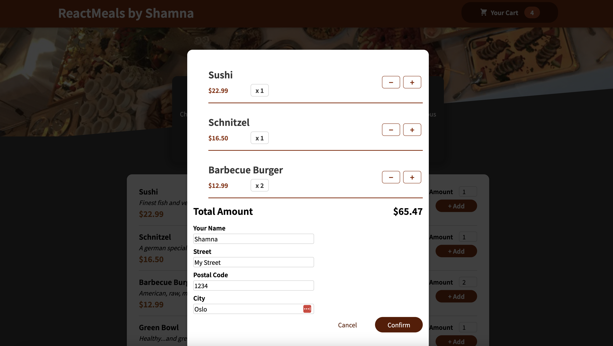

# React Food Ordering App

This is a hobby project I did when I was learning ReactJS.

## How To Run locally

1.  Clone and checkout the project
2.  From the root directory, run `npm install`
3.  Once the installation is complete. Run `npm start`
4.  Go to http://localhost:3000

## Screenshots

1. The main app component
   

2. Modal overlay for showing the cart
   

3. Modal overlay state change when clicking order
   
